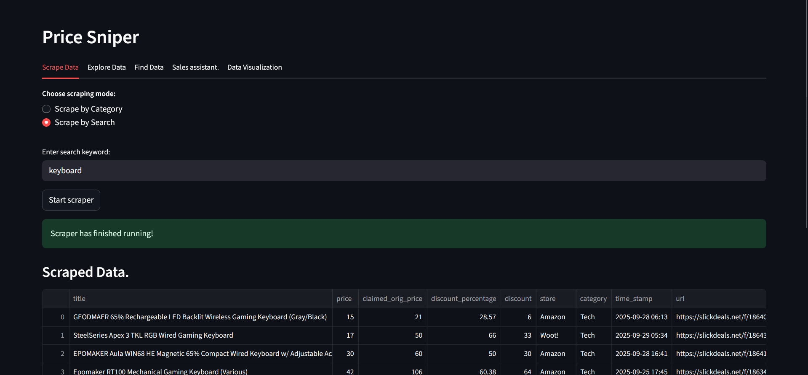
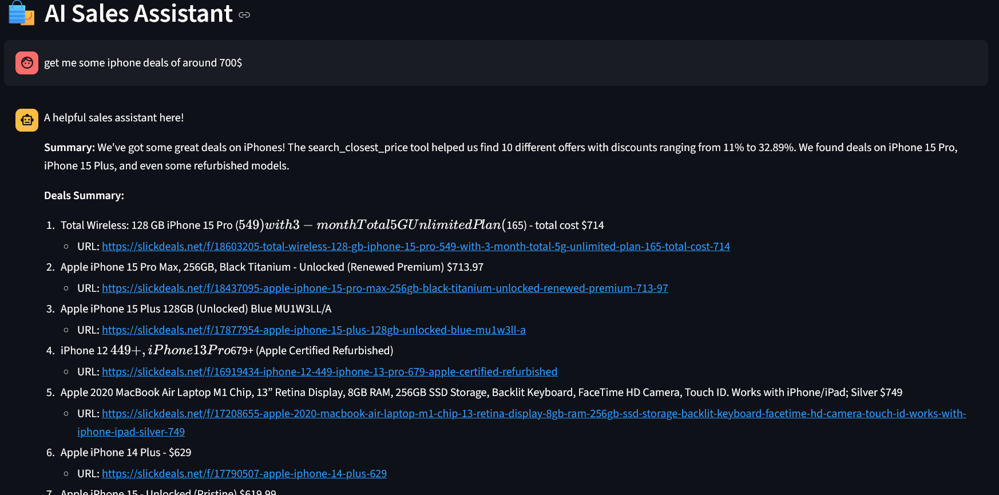

# Smart Price Sniper

A Python tool that extracts deal data from **Slickdeals** and helps users find the best value for their money.  
It can be used for personal deal tracking, analytics, or research.

---

## Features

- **Fast Scraper**: Extracts product titles, prices, discounts, store names, and links using `requests` + `BeautifulSoup`.
- **Database Storage**: Saves pre-cleaned deal data into **PostgreSQL** for structured analysis.
- **Streamlit Dashboard**: Interactive UI with filtering, search, and visualizations (e.g., top stores by average discount).
- **AI Agent**: Uses LLaMA3 (Optional) with tools:
  - *Query Searcher*: Search deals by keywords ,price or freshness in the database.
  - *Deep Scraper*: Scrape additional info like description and comments directly from deal URLs.
- **Lightweight & Modular**: Easy to extend with new data sources or features.

---
## Screenshots

- **Dashboard Example**: Scraping by search
  

- **AI Agent Example**: Querying deals by keywords
    <br><br>
  

## Project Structure

```text
smart-price-sniper/
├── ai_agents/ # AI assistant tools and logic (LLaMA3 integration)
├── scraper/ # Slickdeals scraper (BeautifulSoup + requests)
├── manage_db/ # PostgreSQL database management
├── ui_tabs/ # Streamlit dashboard tabs (scraper, explorer, visualizations)
├── data/ # Data cleaning and helper datasets
├── support_llm/ # LLM-powered category filler
├── utils/ # Utility functions
├── tests/ # Test scripts
├── ui.py # Main Streamlit app
├── requirements.txt
├── .env # Contains database creds(password,user,etc) 
└── README.md
```

---

## Getting Started

### Prerequisites

- Python 3.8+
- PostgreSQL database (connection set via `.env`)
- [pip](https://pip.pypa.io/en/stable/) for dependencies

### Installation

1. **Clone the repository:**
    ```bash
    git clone https://github.com/dav404-cmd/price-sniper.git
    cd price-sniper
    ```

2. **Install dependencies:**
    ```bash
    pip install -r requirements.txt
    ```

3. **Set up your environment variables:**
    - Copy `.env.example` to `.env` and fill in your PostgreSQL credentials.

### Usage

#### Launch the Web App

```bash
streamlit run ui.py
```

#### Scrape Deals

- Use the "Scrape Data" tab in the UI
- Run scrapers directly:
    ```bash
    python scraper/scraper_runner_bs4.py
    ```
  - This will run a scraper with category **tech** as default.
- Customize the search 
  - You can change the type of scraping in `scraper/scraper_runner_bs4.py`
    ```python
    if __name__ == "__main__":
        run_by_search(query = "iphone",max_pages = 50)
    ```
    or 
    ```python 
    if __name__ == "__main__":
        run_by_categories(category = "tech",max_page = 50)
    ```
    to scrape by categories or search, switch the `category = ""` or `query = ""` with what you want to scrape and `max_page = `as in how many pages to scrape.
  
---

## Author

Created by [dav404-cmd](https://github.com/dav404-cmd) - feel free to contact for questions, suggestions, or collaboration opportunities.

---
