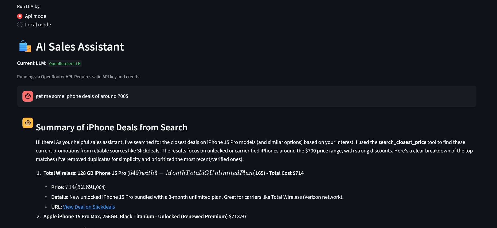

# Smart Price Sniper

Smart Price Sniper is a full-stack project that scrapes live deal data from Slickdeals, stores it in PostgreSQL, and lets users explore it through an interactive Streamlit dashboard and optional AI-powered search agents.

---

## Features

- **Fast Scraper**: Extracts product titles, prices, discounts, store names, and links using `requests` + `BeautifulSoup`.
- **Database Storage**: Saves pre-cleaned deal data into **PostgreSQL** for structured analysis.
- **Streamlit Dashboard**: Interactive UI with filtering, search, and visualizations (e.g., top stores by average discount).
- **AI Agent**: Uses LLaMA3 locally(Optional) or via the OpenRouter API, with the following tools::
  - *Query Searcher*: Search deals by keywords ,price or freshness in the database.
  - *Deep Scraper*: Scrape additional info like description and comments directly from deal URLs.
- **Lightweight & Modular**: Easy to extend with new data sources or features.
- **Automation Workflow**: End-to-end orchestration using **Apache Airflow** for scheduled scraping and data updates.
- **Containerized Airflow Environment**: Airflow runs locally inside **Docker containers** for easy setup, isolation, and reproducibility.

---
## Screenshots

- **Dashboard Example**: Scraping by search
  

- **AI Agent Example**: Querying deals by keywords
    <br><br>
  

## Project Structure

```text
smart-price-sniper/
├── airflow-orchestrator/ #containeriozed automated workflow (airflow,docker)
├── ai_agents/ # AI assistant tools and logic (LLaMA3 integration)
├── scraper/ # Slickdeals scraper (BeautifulSoup + requests)
├── manage_db/ # PostgreSQL database management
├── ui_tabs/ # Streamlit dashboard tabs (scraper, explorer, visualizations)
├── data/ # Data cleaning and helper datasets
├── support_llm/ # LLM-powered category filler
├── utils/ # Utility functions
├── tests/ # Test scripts
├── ui.py # Main Streamlit app
├── requirements.txt
├── .env # Contains database creds(password,user,etc) 
└── README.md
```

---

## Getting Started

### Prerequisites

- Python 3.8+
- PostgreSQL database (connection set via `.env`)
- [pip](https://pip.pypa.io/en/stable/) for dependencies
- [ollama](https://llamaimodel.com/download/) for local llm use
    - After installing ollama run the following bash to install llama3. 
    ```bash
     ollama run llama3
   ```

### Installation

1. **Clone the repository:**
    ```bash
    git clone https://github.com/dav404-cmd/price-sniper.git
    cd price-sniper
    ```

2. **Install dependencies:**
    ```bash
    pip install -r requirements.txt
    ```

3. **Set up your environment variables:**
   - Copy the example below to `.env` and fill in your credentials.
   - Example :
   ```text
   DB_NAME = your_db_name
   DB_USER = your_db_username
   DB_PASSWORD = your_db_password
   DB_HOST = your_db_host
   DB_PORT = your_db_port  
   OPENROUTER_API_KEY = your_openrouter_api(optionally,you can just use local llm)    
    ```
### Usage

#### Launch the Web App

```bash
streamlit run ui.py
```

#### Scrape Deals

- Use the "Scrape Data" tab in the UI
- Run scrapers directly:
    ```bash
    python scraper/scraper_runner_bs4.py
    ```
  - This will run a scraper with category **tech** as default.
- Customize the search 
  - You can change the type of scraping in `scraper/scraper_runner_bs4.py`
    ```python
    if __name__ == "__main__":
        run_by_search(query = "iphone",max_pages = 50)
    ```
    or 
    ```python 
    if __name__ == "__main__":
        run_by_categories(category = "tech",max_page = 50)
    ```
    to scrape by categories or search, switch the `category = ""` or `query = ""` with what you want to scrape and `max_page = `as in how many pages to scrape.
  
---
## Airflow Automation Setup (Docker)
This project includes a fully automated data pipeline powered by Apache Airflow and Docker.
It handles scheduled scraping, AI-assisted categorization (via LLaMA3), and database updates without manual triggering.
While currently limited to a single DAG that scrapes any keyword daily, the system is designed with modularity in mind, allowing for easy expansion and integration of additional features.

### Prerequisites

- [Docker](https://www.docker.com/products/docker-desktop/)
- wsl (if you are on window)
  ```bash
  wsl --install
  ```

### Directory Structure
```text
smart-price-sniper/
├── airflow-orchestrator/
│   ├── airflow_env/           # Local virtual env for airflow + docker setup
│   ├── dags/                  # Your DAG files
│   ├── logs/                  # Airflow logs
│   ├── plugins/               # Custom operators/hooks (optional)
│   ├── Dockerfile             # Airflow image build
│   ├── docker-compose.yaml    # Airflow + Postgres setup
│   └── .env                   # Airflow-related environment variables
```

### Environment Variables
- Copy the example below to `airflow-orchestrator/.env` and fill in your credentials.
   - Example :
   ```text
  FERNET_KEY= get your fernet key from instruction bellow 

  AIRFLOW_FIRST_NAME = your airflow first name 
  AIRFLOW_LAST_NAME = your airflow last name
  AIRFLOW_EMAIL = your airflow email
   ```
  - FERNET_KEY :
     - Get your FERNET_KEY by running the following bash.
     ```bash
    python -c "from cryptography.fernet import Fernet; print(Fernet.generate_key().decode())"
     ```
---

### Running the Airflow Pipeline

1. Initialize Airflow and build containers:
    ```bash
    docker compose -f airflow-orchestrator/docker-compose.yaml up airflow-init
    ```

2. Start all services:
    ```bash
    docker compose -f airflow-orchestrator/docker-compose.yaml up
    ```

3. Access the Airflow web UI at:
    ```text
   http://localhost:8080
    ```
   - **Username**: admin
   - **Password**: admin

4. Close services:
    ```bash
   docker compose -f airflow-orchestrator/docker-compose.yaml down
    ```

---

### 🧭 Future Plans
- Add email alerts if desired deals are found.
- Expansion data sources.

---

## Deployment
This project is deployed in streamlit cloud community with its database in supabase.

😊Check it out [Here](https://smart-price-sniper.streamlit.app/).<br>
😉Every time you scrape something in there the database will expand.

---

## License

This project is licensed under the MIT License. See [LICENSE](LICENSE) for details.

---


## Author

Created by [dav404-cmd](https://github.com/dav404-cmd) - feel free to contact for questions, suggestions, or collaboration opportunities.

---
